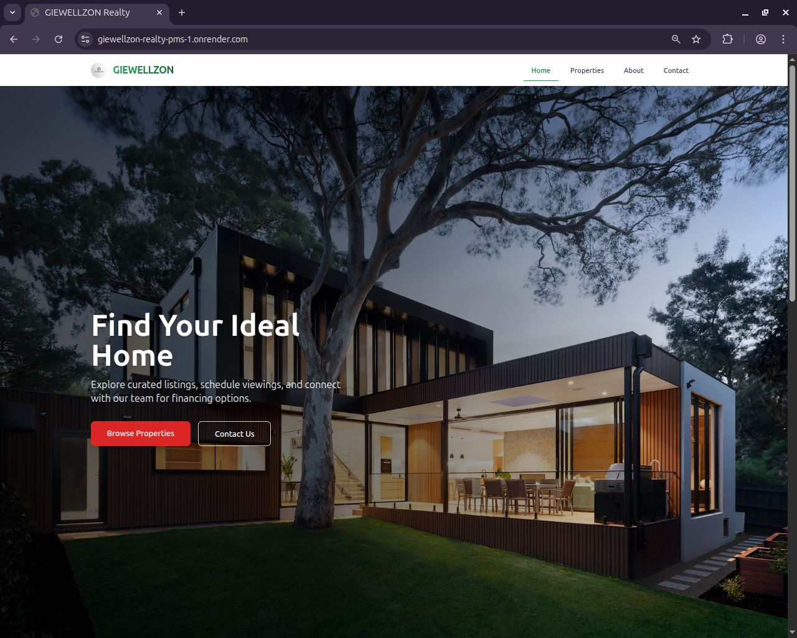
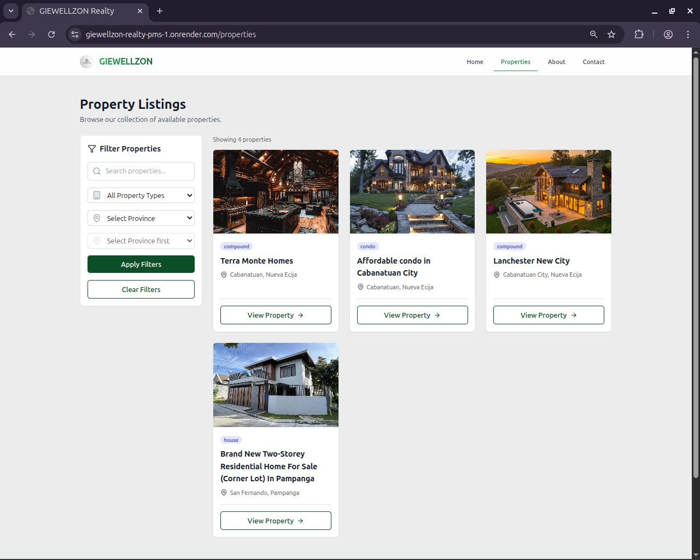
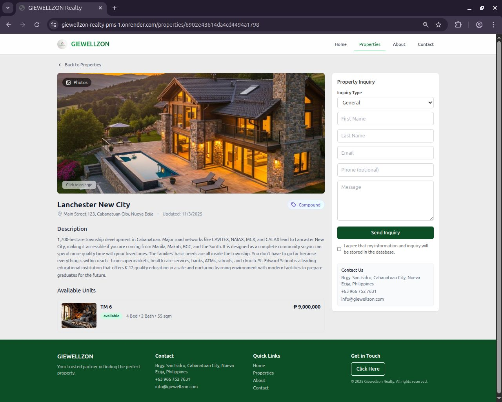

# Real Estate Listing System

A web-based platform for publishing, browsing, and managing property listings. It allows sellers or agents to post detailed property information, including photos, pricing, and location data, while enabling buyers to search, filter, and save listings. The system streamlines real estate discovery and communication between buyers and sellers.

# Table of content

- [Images](#images)
- [Install](#install)
- [Preview](#preview)

## Images

### Home



### Listing



### Property detail



## Install

```
cd backend
npm install
npm run dev

# new terminal
cd front end
npm install
npm run dev
```

## Preview

[Link](https://giewellzon-realty-pms-1.onrender.com)
